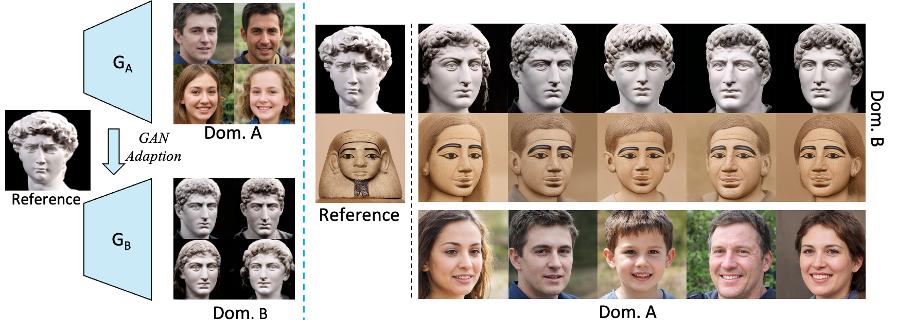

# DiFa: Towards Diverse and Faithful One-shot Adaption of Generative Adversarial Networks
[](https://arxiv.org/abs/2207.08736)

> **Towards Diverse and Faithful One-shot Adaption of Generative Adversarial Networks**<br>
> Yabo Zhang, Mingshuai Yao, Yuxiang Wei, Zhilong Ji, Jinfeng Bai, Wangmeng Zuo <br>
> 
>**Abstract**: <br>
> One-shot generative domain adaption aims to transfer a pre-trained generator on one domain to a new domain using one reference image only. However, it remains very challenging for the adapted generator (i) to generate diverse images inherited from the pre-trained generator while (ii) faithfully acquiring the domain-specific attributes and styles of the reference image. In this paper, we present a novel one-shot generative domain adaption method, i.e., DiFa, for diverse generation and faithful adaptation. For global-level adaptation, we leverage the difference between the CLIP embedding of reference image and the mean embedding of source images to constrain the target generator. For local-level adaptation, we introduce an attentive style loss which aligns each intermediate token of adapted image with its corresponding token of the reference image. To facilitate diverse generation, selective cross-domain consistency is introduced to select and retain the domain-sharing attributes in the editing latent W+ space to inherit the diversity of pre-trained generator. Extensive experiments show that our method outperforms the state-of-the-arts both quantitatively and qualitatively, especially for the cases of large domain gaps. Moreover, our DiFa can easily be extended to zero-shot generative domain adaption with appealing results.




## Getting Started

The code relies on the official implementation of [StyleGAN-NADA](https://github.com/rinongal/StyleGAN-nada), [pSp](https://github.com/eladrich/pixel2style2pixel), [e4e](https://github.com/omertov/encoder4editing), 
and the pytorch implementation of [StyleGAN2](https://github.com/rosinality/stylegan2-pytorch/).

### Installation

- Clone this repo:

  ```shell
  git clone [url_of_this_repo](https://github.com/1170300521/DiFa.git)
  cd DiFa
  ```

- Dependencies:

  We recommend running this repository using [Anaconda](https://docs.anaconda.com/anaconda/install/). All dependencies for defining the environment are provided in `environment.yaml`.

- Download pretrained [StyleGAN2](https://github.com/rosinality/stylegan2-pytorch/) (or [StyleGAN-ADA](https://github.com/NVlabs/stylegan2-ada-pytorch)) to `weights` and GAN inversion models([pSp](https://github.com/eladrich/pixel2style2pixel) or [e4e](https://github.com/omertov/encoder4editing)) to `weights/psp_weights`

### Datasets

We provide some reference images in `reference_images/`. 

You can obtain more training images from [Artstation-Artistic-face-HQ (AAHQ)](https://github.com/onion-liu/aahq-dataset), [MetFaces](https://github.com/NVlabs/metfaces-dataset), [The Face of Art](https://github.com/papulke/face-of-art), and [AFHQ-Wild](https://github.com/clovaai/stargan-v2/blob/master/README.md#animal-faces-hq-dataset-afhq).

### Training

To convert a generator from one domain to another,  run the training script `ZSSGAN/scripts/train.sh`:

```shell
CUDA_VISIBLE_DEVICES=1 python train.py  \
                --batch 2  --dataset "ffhq" \
                --n_sample 4 --output_dir "output" \
                --lr 0.002 \
                --frozen_gen_ckpt ../weights/stylegan2-ffhq-config-f.pt \
                --psp_path ../weights/psp_weights/e4e_ffhq_encode.pt \
                --iter 301 \
                --source_class "photo" \
                --target_class "elsa.png" \
                --source_type "mean" \
                --auto_layer_k 18 \
                --auto_layer_iters 0 --auto_layer_batch 8 \
                --output_interval 50 \
                --mixing 0.0 \
                --save_interval 300 \
                --clip_models  "ViT-B/32" "ViT-B/16" \
                --psp_loss_type "dynamic" \
                --clip_model_weights 1.0 1.0 \
                --psp_model_weight 6 \
                --num_keep_first 7 \
                --psp_alpha 0.6 \
                --lambda_direction 1.0 \
                --lambda_partial 1 \
                --sliding_window_size 50 \
                --style_img_dir ../reference_images/FFHQ/elsa.png \
```

Generally, just specify path to the reference image  `--style_img_dir` and its corresponding `--target_class`.

Addtionally, you may use larger `--psp_alpha` to retain more attributes, larger `--psp_model_weight` to retain each attribute more heavily, larger `--lambda_partial` to acquire more representative characteristics.

Note that when adapting a generator pre-trained on other source domains, you need to modify `--dataset`, path to pre-trained generator  `--frozen_gen_ckpt`, and path to inversion models `--psp_path`.

More arguments and their explanation are provided in `ZSSGAN/options/train_options.py`.

### Inference

To transfer real images, we first utilize [e4e](https://github.com/omertov/encoder4editing) to invert them into $W+$ latent codes, and then input the codes into the adapted generator to obtain adapted images.

Specifically, just run the inference script `ZSSGAN/scripts/inference.sh`:

```shell
python inference.py  \
                --dataset 'ffhq' \
                --frozen_gen_ckpt path/to/adapted_generator \
                --psp_path ../weights/psp_weights/e4e_ffhq_encode.pt \
                --real_image_path path/to/real_image \
```

